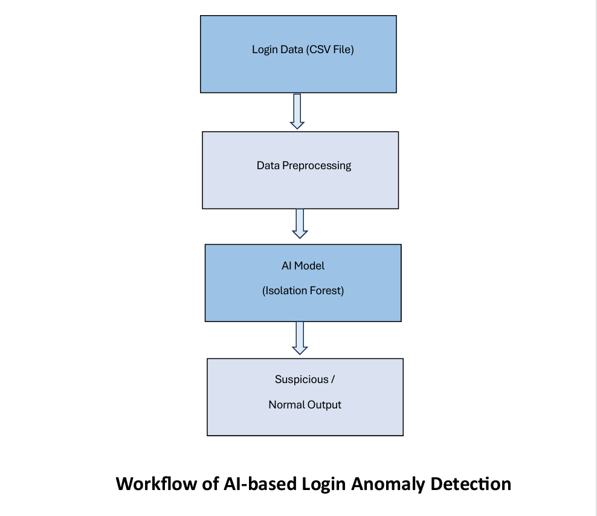

# AI-Based Login Anomaly Detection Using Artificial Intelligence

##  Project Summary
This project focuses on detecting suspicious login activities using Artificial Intelligence techniques. The system analyzes user login behavior such as login time and failed login attempts to identify abnormal patterns. An unsupervised machine learning algorithm, Isolation Forest, is used to detect anomalies without requiring labeled attack data. The project demonstrates a practical application of AI in cyber security and is relevant to Security Operations Center (SOC) operations for threat detection and monitoring.

---

##  Problem Statement
Traditional rule-based security systems may fail to identify unusual login behavior that does not match predefined attack patterns. There is a need for an intelligent system that can automatically detect abnormal login activities to improve cyber security monitoring and reduce manual analysis efforts.

---

##  Solution Overview
An AI-based login anomaly detection system is developed using the Isolation Forest algorithm. The system automatically analyzes login behavior and identifies suspicious activities by detecting deviations from normal login patterns. This approach enhances security monitoring by identifying potential threats at an early stage.

---

##  Technologies Used
- **Programming Language:** Python  
- **Libraries:** Pandas, Scikit-learn  
- **Algorithm:** Isolation Forest  
- **Platform:** Windows  
- **Tools:** Command Prompt, VS Code  

---

##  Implementation Overview
The implementation is carried out using Python programming language. The login dataset containing username, login time, and failed login attempts is loaded and preprocessed using the Pandas library. Relevant numerical features are selected and provided as input to the Isolation Forest algorithm. The model analyzes user login behavior and assigns anomaly labels, where **-1 indicates suspicious activity** and **1 indicates normal behavior**. The detected anomalous login records are displayed as output for security analysis.

---

##  Output & Result
The system successfully identifies suspicious login activities based on abnormal login times and multiple failed login attempts. The output highlights anomalous login records, allowing security analysts to quickly identify potential security threats.

---

##  SOC Relevance
This project is highly relevant to Security Operations Center operations as it automates the detection of abnormal login behavior. It helps in identifying unauthorized access attempts, supports threat monitoring, and reduces manual log analysis efforts using Artificial Intelligence techniques.

---

## Future Enhancements
- Real-time log monitoring  
- IP address and geo-location analysis  
- SIEM tool integration  
- Advanced ML and deep learning models  

---

##  How to Run the Project
```bash
pip install pandas scikit-learn
python anomaly_detection.py

---

 Author
Name: Jeyadharshni R
Role: AI Intern | Aspiring SOC Analyst
[View Code](anomaly_detection.py)


